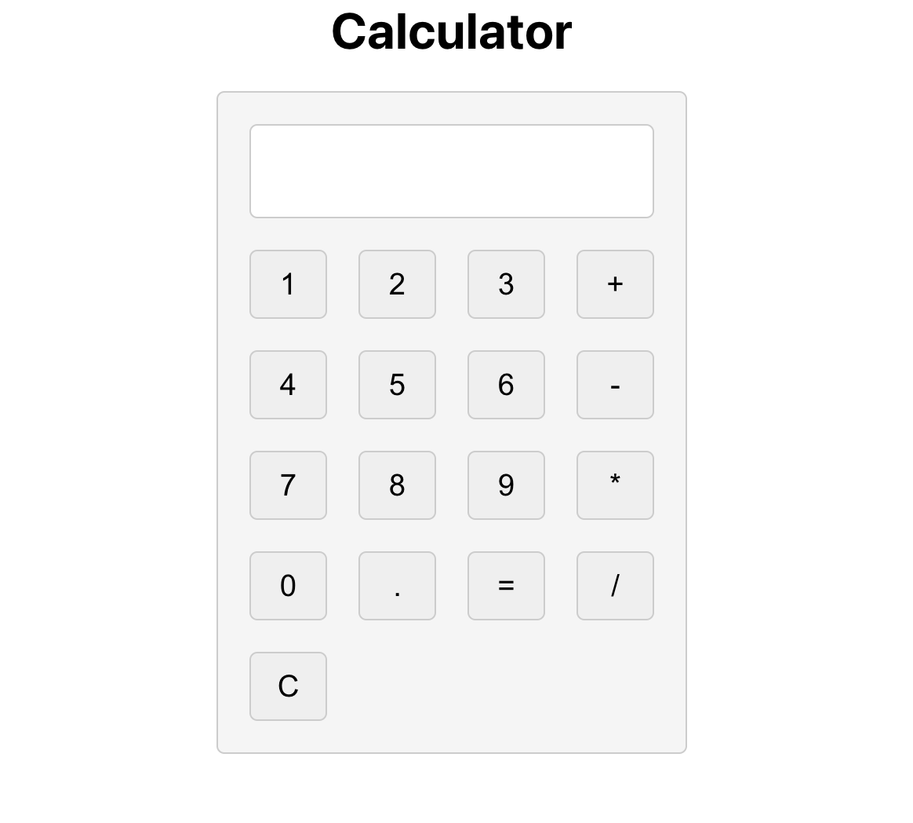
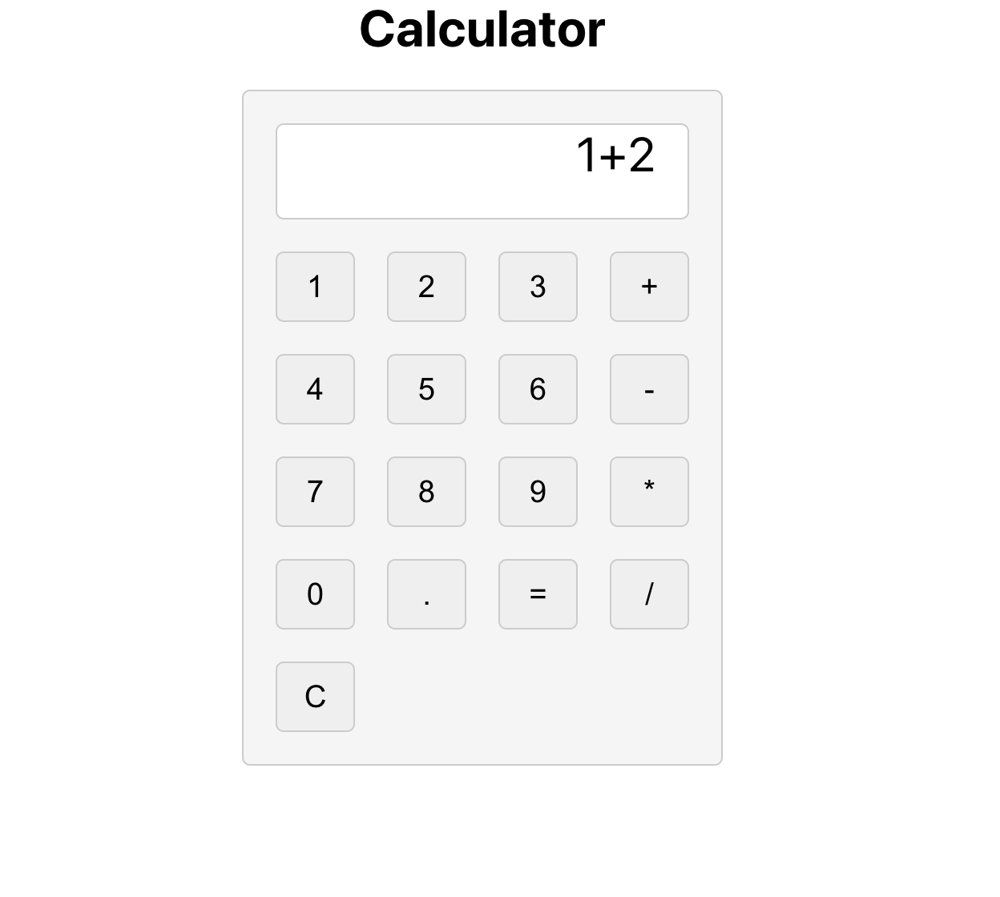
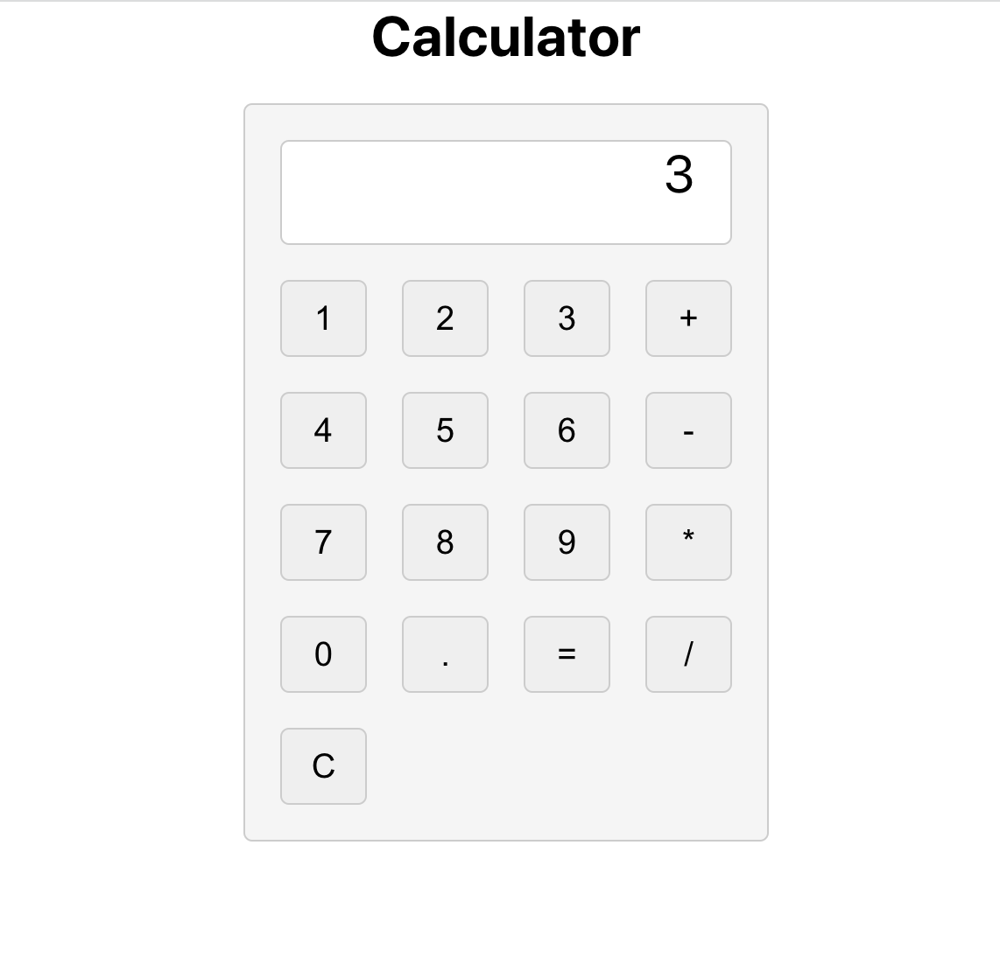

# Calculator

## Description

- This is a simple calculator that can perform basic arithmetic operations written in React.

- There is a display that shows the current value of the calculator.

- All the buttons are clickable and perform the operations as expected.

## Screenshots

